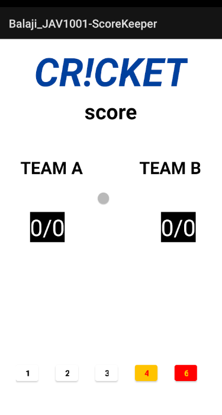

# JAV1001-ScoreKeeper

You can find the code [here](https://github.com/balajic19/Balaji_JAV1001-ScoreKeeper.git) to clone.

- Student 1:  
  Name: Balaji Chandupatla  
  Student Number: A00245077  

- Student 2:  
  Name: Pruthvi Sai Korupu  
  Student Number: A00245392  

## Lab Description:  
- Design a layout to showcase the scores of Cricket game between two teams.
- The UI looks as below

<!--  -->
